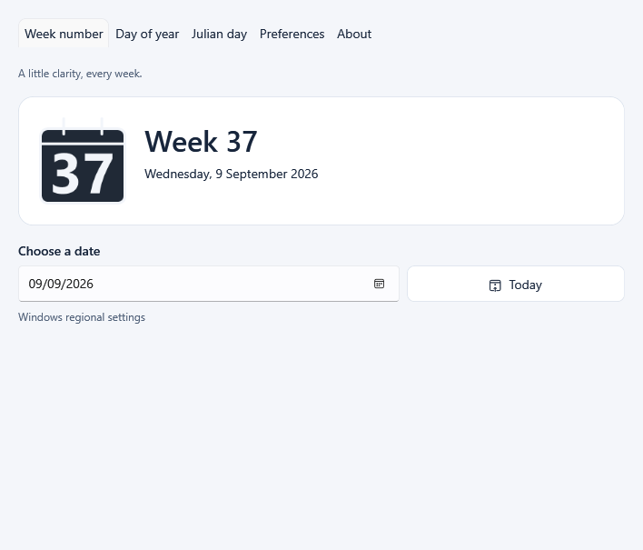

<section class="hero" aria-labelledby="hero-title">
  

    
For Windows

    <h1 id="hero-title">Know the week. Without opening anything.</h1>
    
Voltura WeekNumber keeps the current week number visible in your notification area, right beside the Windows clock.

    

      <a class="button button-primary" href="https://github.com/voltura/voltura-weeknumber/releases/latest">Download for Windows</a>
      <a class="button button-secondary" href="https://github.com/voltura/voltura-weeknumber/releases">Release notes</a>
    

    
Windows · Free and open source · No account

  

  

    

      
      

        <strong>Your week, always in view</strong>
        The number changes automatically as each new week begins.
      

    

    <figure class="app-window">
      
      <figcaption>The calendar is there when you need more than a glance.</figcaption>
    </figure>
  

</section>

<section class="section section-intro" aria-labelledby="why-title">
  

    
A little clarity, every week

    <h2 id="why-title">The week number is the feature.</h2>
    
Open the calendar only when you want to look further.

  

  

    <article class="feature-card feature-card-primary">
      01
      <h3>Always visible</h3>
      
See the current week on a calendar icon in the Windows notification area.

    </article>
    <article class="feature-card">
      02
      <h3>Any date, one click away</h3>
      
Choose any date to see its week number, then return to today with one click.

    </article>
    <article class="feature-card">
      03
      <h3>Your calendar rules</h3>
      
Follow Windows, use ISO 8601, or choose your own week rules.

    </article>
  

</section>

<section class="section capabilities" aria-labelledby="capabilities-title">
  

    
More when you need it

    <h2 id="capabilities-title">Useful tools. Kept simple.</h2>
    
Open the app for deeper calendar and date work.

  

  

    <article class="capability-card">
      Browse
      <h3>Calendar</h3>
      
Browse years, months, and weeks with clear week numbers and date ranges. Pin the window on top while you plan.

    </article>
    <article class="capability-card">
      Compare
      <h3>Date span</h3>
      
Compare two dates by calendar days, weekdays, weekend days, or whole weeks.

    </article>
    <article class="capability-card">
      Navigate
      <h3>Week navigation</h3>
      
Move one week at a time, or jump a chosen number of weeks from today.

    </article>
    <article class="capability-card">
      Reference
      <h3>Find and copy</h3>
      
Find a week’s date range, then copy its ISO, short, or localized reference.

    </article>
    <article class="capability-card">
      Convert
      <h3>Date tools</h3>
      
Find a date’s day-of-year or Julian day number, or convert either number back to a date.

    </article>
    <article class="capability-card">
      Quick access
      <h3>Keyboard shortcuts</h3>
      
Choose global shortcuts to open Week number or Calendar from another app while Voltura WeekNumber is running.

    </article>
  

</section>

<section class="section essentials" aria-labelledby="essentials-title">
  

    
Useful, not demanding

    <h2 id="essentials-title">Quietly does its job.</h2>
  

  

    
<strong>Works offline</strong>Calendar lookups need no connection.

    
<strong>Looks at home</strong>Light, dark, or system appearance with customizable icon colors.

    
<strong>Speaks your language</strong>Choose from 21 languages or follow Windows.

    
<strong>Stays out of the way</strong>Closing the window leaves the week number available in the tray.

  

</section>

<section class="section download" id="download" aria-labelledby="download-title">
  

    
Get Voltura WeekNumber

    <h2 id="download-title">A clearer week starts here.</h2>
    
Download the current Windows release. The standard installer is the simplest choice for most people.

    <a class="button button-primary" href="https://github.com/voltura/voltura-weeknumber/releases/latest">View the latest release</a>
  

  

    <article class="package recommended">
      
Recommended<h3>Standard installer</h3>

      
A smaller download. Installs the Microsoft .NET 10 Desktop Runtime if it is needed.

      <code>Setup-…-win-x64.exe</code>
    </article>
    <article class="package">
      
<h3>Offline installer</h3>

      
Includes the runtime, so installation does not need a separate runtime download.

      <code>Setup-…-win-x64-full.exe</code>
    </article>
    <article class="package">
      
<h3>Portable ZIP</h3>

      
Extract it to a writable folder and run the app without installation.

      <code>…-win-x64.zip</code>
    </article>
  

</section>

<section class="section setup" aria-labelledby="setup-title">
  

    
Getting started

    <h2 id="setup-title">Three simple steps.</h2>
  

  <ol class="steps">
    <li>1
<strong>Install and open</strong>
Use an installer, or extract and open the portable version.

</li>
    <li>2
<strong>Find the calendar icon</strong>
It appears beside the Windows clock or in the notification-area overflow.

</li>
    <li>3
<strong>Glance—or open</strong>
Read the week from the icon. Double-click it whenever you want the full calendar.

</li>
  </ol>
</section>

<section class="section details" aria-label="More information">
  

    
Languages and personalization

    

      
English, Swedish, German, French, Danish, Finnish, Icelandic, Norwegian Bokmål, Polish, Italian, Spanish, Cantonese, Japanese, Brazilian Portuguese, Simplified Chinese, Traditional Chinese, Dutch, Korean, Russian, Turkish, and Indonesian are included.

      
Choose a language independently of your calendar rules. You can also customize the tray icon, export it as an ICO file, choose light, dark, or system appearance, and import or export your preferences.

      
In Preferences, assign separate keyboard shortcuts for Week number and Calendar. Preview your key combination as you press it, edit or clear a saved shortcut, and get feedback if a shortcut is invalid or already in use.

    

  

  

    
Updates and privacy

    

      
Installed copies can check for signed updates and download them automatically; you choose when to install a ready update. Portable copies are updated by downloading a new release.

      
Your settings stay on your computer. The app does not upload date lookups, settings, or diagnostic logs. Update checks contact GitHub, and the standard installer may download the runtime from Microsoft. Read the <a href="https://github.com/voltura/voltura-weeknumber/blob/master/PRIVACY.md">privacy policy</a>.

    

  

  

    
Help and project information

    

      <a href="https://github.com/voltura/voltura-weeknumber/issues/new?template=bug_report.yml">Report a bug</a>
      <a href="https://github.com/voltura/voltura-weeknumber/blob/master/CONTRIBUTING.md">Contributing and building from source</a>
      <a href="https://github.com/voltura/voltura-weeknumber/blob/master/docs/architecture.md">Architecture</a>
      <a href="https://github.com/voltura/voltura-weeknumber/blob/master/docs/validation.md">Validation guide</a>
      <a href="https://github.com/voltura/voltura-weeknumber/blob/master/SECURITY.md">Security policy</a>
      <a href="https://github.com/voltura/voltura-weeknumber/blob/master/LICENSE">MIT License and third-party notices</a>
    

  

</section>

<section class="project-strip" aria-label="Project statistics and support">
  

    
    
    
  

  
Made by <a href="https://voltura.se/" aria-label="Voltura AB home">Voltura AB</a>. Support development through <a href="https://ko-fi.com/G2G74W5F8">Ko-fi</a> or <a href="https://www.paypal.com/donate?hosted_button_id=7PN65YXN64DBG">PayPal</a>.

</section>
